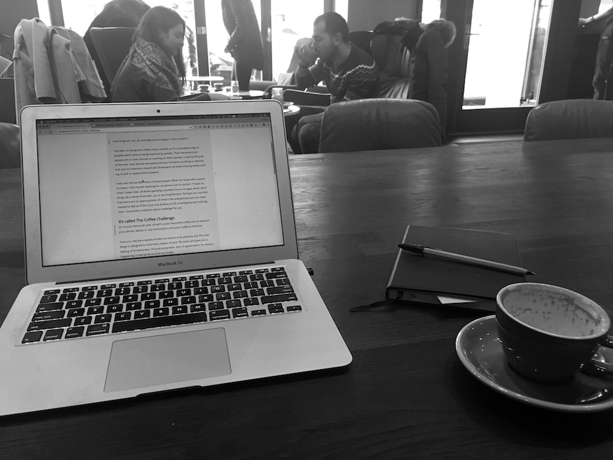

I’m running an experiment on myself at the moment…

> How long can I sit, do nothing and be happy in the moment?

I’ve taken to doing this coffee shops recently as it’s a wonderful way to people watch without being watched by people. That’s because most people are on their phones or working on their laptops. Lured by the pull of the ever-near phone, we waste precious moments scrolling on devices that pull our attention inward and downward, all while missing what’s waiting to pull us upward and outward.

I was and still am like many of these people. When I’m faced with a spare moment, I find myself reaching for my phone out of comfort.  “I have no time” I have cried, all while spending countless hours on apps which don’t bring me a sense of wonder, joy or accomplishment. Perhaps you too find that there are no spare pockets of time in life and perhaps you too have started to feel as if life is just one endless scroll of ambiguity and nothingness. I have both a solution and a challenge for you. 

### It’s called The Coffee Challenge.

> Go to your favourite cafe, sit with a your favourite coffee and sit without your phone, laptop or any stimulation until your coffee is finished.

Now you may be a speedy drinker by nature or by practice, but this challenge is designed to slow every aspect of your life down and give you a feeling of timelessness. Of pure enjoyment. And of appreciation for what is happening in the world around you today. 

When our attention is buried in our phone, we miss moments like - 

* The couple who just walked in the coffee shop and gazed lovingly at one another for a split second. 
* The two women doing a crossword together at a window. 
* The man who has walked past the shop window a few times, seemingly lost.
* The little boy arguing with his mum because he doesn’t want to wear his coat.
* The couple taking a selfie of themselves enjoying a morning coffee

There is a beauty in the normality of everyday life, people going about their days as if it were nothing special - and yet it is and it isn’t. All of these moments are inconsequential and yet fascinating to observe. I am only granted the privilege to see these people, as they are, because I decided to put away my phone and note what I could see around me.

Can I entice you to try The Coffee Challenge for yourself? To enrich your life with ten minutes of pleasure? To slow down time and appreciate finer details that would otherwise pass unnoticed? If your answer is a yes, leave me a comment with your favourite coffee below and what you noticed while you enjoyed it. I can’t wait to hear all about it.

PS. My favourite coffee is a flat white with almond milk and this blog post was centered around what I saw this morning.
